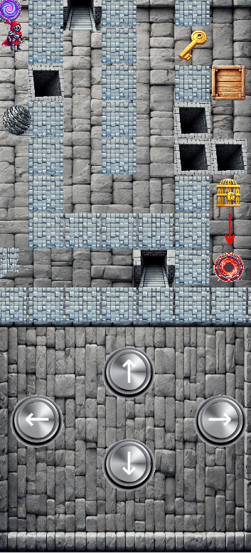

# ICS4U Final Project by Zilin
<h1 align="center">
  
</h1>

link to the game:
https://zilin-chen-1.github.io/ICS4U-Final-Project-Zilin/

- Click the button/WASD/Arrow keyboard to control the character!

- Try to go to the red portal from the purple portal!

- Rock can destory itself and the broken wall when it touch the broken wall.

- Box can destory itself and the pits.

- Go to another place via stair.

- Try to get the key to open the door!

Ps: you cannot jump directly over pits or pass through walls

<h1 align="center">
  
</h1>
